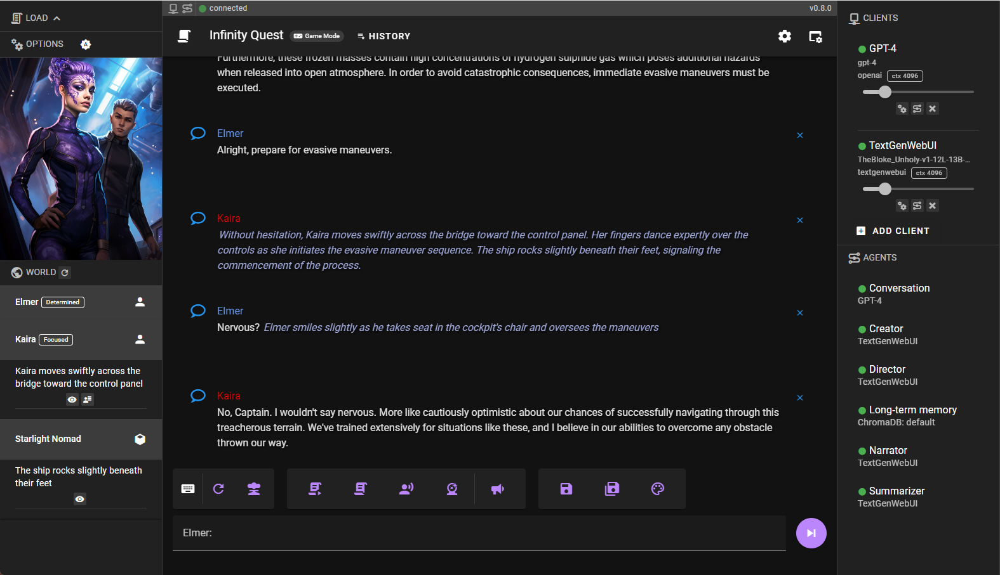
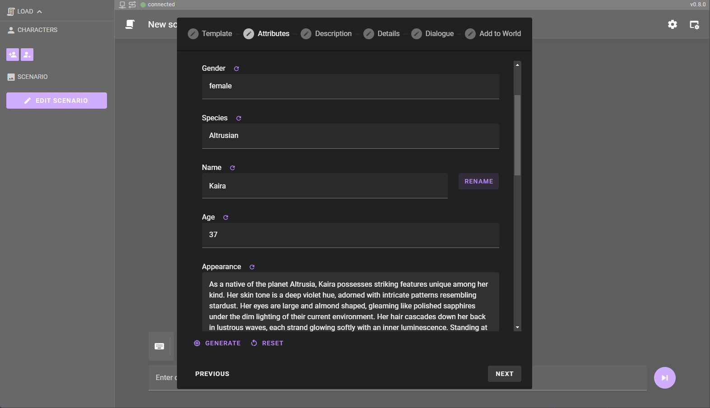
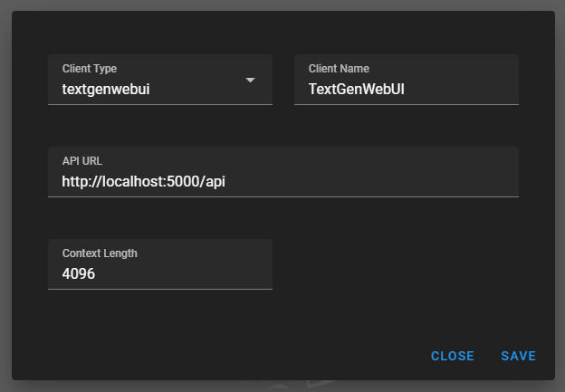
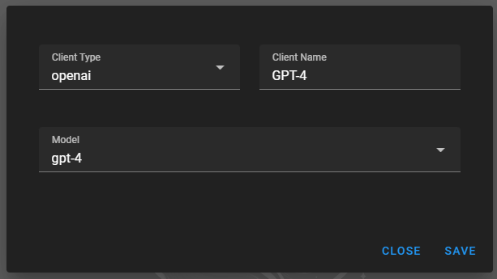
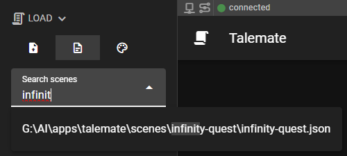
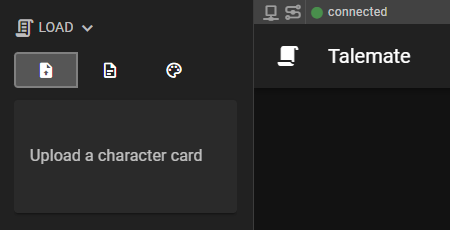

# Talemate

Talemate is an experimental application that allows you to roleplay scenarios with large language models. I've worked on this on and off since early 2023, as a private project, but decided i might as well put in the extra effort and open source it.

It does not run LLMs itself but relies on existing APIs. Currently supports text-generation-webui and openai.

This means you need to either have an openai api key or know how to setup [oobabooga/text-generation-webui](https://github.com/oobabooga/text-generation-webui) (locally or remotely via gpu renting.)




## Current features

- responive modern ui
- multi-client (agents can be connected to separate LLMs)
- agents
    - conversation
    - narration
    - summarization
    - director
    - creative
- long term memory
- narrative world state
- narrative tools
- creative mode 
    - AI backed character creation with template support (jinja2)
    - AI backed scenario creation
- runpod integration
- overridable templates foe all LLM prompts. (jinja2)

## Planned features

Kinda making it up as i go along, but i want to lean more into gameplay through AI, keeping track of gamestates, moving away from simply roleplaying towards a more game-ified experience.

In no particular order:

- Automatic1111 client
- Gameplay loop governed by AI
- Improved world state
- Dynamic player choice generation
- Better creative tools
    - node based scenario / character creation
- Improved long term memory (base is there, but its very rough at the moment)
- Improved director agent
    - Right now this doesn't really work well on anything but GPT-4 (and even there it's debatable). It tends to steer the story in a way that introduces pacing issues. It needs a model that is creative but also reasons really well i think.

# Quickstart

## Installation

### Windows

1. Download and install Python 3.10 or higher from the [official Python website](https://www.python.org/downloads/windows/).
1. Download and install Node.js from the [official Node.js website](https://nodejs.org/en/download/). This will also install npm.
1. Download the Talemate project to your local machine. Download from [the Releases page](https://github.com/final-wombat/talemate/releases).
1. Unpack the download and run `install.bat` by double clicking it. This will set up the project on your local machine.
1. Once the installation is complete, you can start the backend and frontend servers by running `start.bat`.
1. Navigate your browser to http://localhost:8080

### Linux

`python 3.10` or higher is required.

1. `git clone git@github.com:final-wombat/talemate`
1. `cd talemate`
1. `source install.sh`
1. Start the backend: `python src/talemate/server/run.py runserver --host 0.0.0.0 --port 5001`.
1. Open a new terminal, navigate to the `talemate_frontend` directory, and start the frontend server by running `npm run serve`.

## Configuration

### OpenAI

To set your openai api key, open `config.yaml` in any text editor and uncomment / add

```yaml
openai:
    api_key: sk-my-api-key-goes-here
```

You will need to restart the backend for this change to take effect.

### RunPod

To set your runpod api key, open `config.yaml` in any text editor and uncomment / add

```yaml
runpod:
    api_key: my-api-key-goes-here
```
You will need to restart the backend for this change to take effect.

Once the api key is set Pods loaded from text-generation-webui templates (or the bloke's runpod llm template) will be autoamtically added to your client list in talemate. 

**ATTENTION**: Talemate is not a suitable for way for you to determine whether your pod is currently running or not. **Always** check the runpod dashboard to see if your pod is running or not.

## Recommended Models

Note: this is my personal opinion while using talemate. If you find a model that works better for you, let me know about it.

Will be updated as i test more models and over time.

| Model Name                    | Status           | Type            | Notes                                                                                                             |
|-------------------------------|------------------|-----------------|-------------------------------------------------------------------------------------------------------------------|
| [GPT-4](https://platform.openai.com/) | GOOD            | Remote         | Costs money and is heavily censored, while talemate will send a general "decensor" system prompt, depending on the type of content you want to roleplay, there is a chance your key will be banned. **If you do use this make sure to monitor your api usage, talemate tends to send a lot more requests than other roleplaying applications.** |
| [GPT-3.5-turbo](https://platform.openai.com/) | AVOID | Remote         | Costs money and is heavily censored, while talemate will send a general "decensor" system prompt, depending on the type of content you want to roleplay, there is a chance your key will be banned. Can roleplay, but not great at consistently generating JSON responses needed for various parts of talemate (world-state etc.) |
| [Nous Hermes LLama2](https://huggingface.co/TheBloke/Nous-Hermes-Llama2-GPTQ) | RECOMMENDED | 13B model | My go-to model for 13B parameters. It's good at roleplay and also smart enough to handle the world state and narrative tools. A 13B model loaded via exllama also allows you run chromadb with the xl instructor embeddings off of a single 4090. |
| [MythoMax](https://huggingface.co/TheBloke/MythoMax-L2-13B-GPTQ) | RECOMMENDED | 13B model | Similar quality to Hermes LLama2, but a bit more creative. Rarely fails on JSON responses. |
| [Synthia v1.2 34B](https://huggingface.co/TheBloke/Synthia-34B-v1.2-GPTQ) | RECOMMENDED | 34B model | Cannot be run at full context together with chromadb instructor models on a single 4090. But a great choice if you're running chromadb with the default embeddings (or on cpu). |
| [Genz](https://huggingface.co/TheBloke/Genz-70b-GPTQ) | GOOD | 70B model | Great choice if you have the hardware to run it (or can rent it).  |
| [Synthia v1.2 70B](https://huggingface.co/TheBloke/Synthia-70B-v1.2-GPTQ) | GOOD | 70B model | Great choice if you have the hardware to run it (or can rent it). |

I have not tested with Llama 1 mnodels in a while, Lazarus was really good at roleplay, but started failing on JSON requirements.

I have not tested with anything below 13B parameters.

## Connecting to an LLM

On the right hand side click the "Add Client" button. If there is no button, you may need to toggle the client options by clicking this button:

### Text-generation-webui


In the modal if you're planning to connect to text-generation-webui, you can likely leave everything as is and just click Save.



### OpenAI

If you want to add an OpenAI client, just change the client type and select the apropriate model.



### Ready to go

You will know you are good to go when the client and all the agents have a green dot next to them.


## Load the introductory scenario "Infinity Quest"

Generated using talemate creative tools, mostly used for testing / demoing.

You can load it (and any other talemate scenarios or save files) by expanding the "Load" menu in the top left corner and selecting the middle tab. Then simple search for a partial name of the scenario you want to load and click on the result.



## Loading character cards

Supports both v1 and v2 chara specs.

Expand the "Load" menu in the top left corner and either click on "Upload a character card" or simply drag and drop a character card file into the same area.



## Further documentation

- Creative mode (docs WIP)
- Prompt template overrides
- [ChromaDB (long term memory)](docs/chromadb.md)
- Runpod Integration